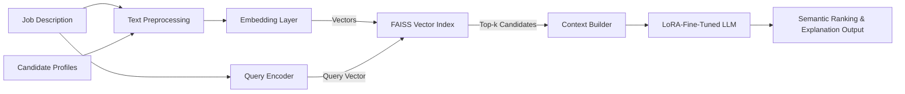

# Project 3:
LLM-Based Semantic Candidate Ranking with Fine-Tuning, RAG & FAISS


## Essence
Semantic ranking system for matching job descriptions to candidate profiles using fine-tuned LLMs and vector-based retrieval


## Objective
- Build a **meaning-aware candidate ranking pipeline** beyond keyword matching
- Integrate **LoRA fine-tuned LLM** with retrieval mechanisms to improve semantic alignment
- Enable recruiters to obtain **contextually relevant candidate suggestions** from text inputs


## Architecture
```
                 +------------------+
   Job Desc -->  | Text Preprocessing| 
                 +------------------+
                           |
                           v
                   +---------------- +
                   | Embedding (TF-IDF / Word2Vec / FastText)       
                   +----------------+
                           |
                           v
                 +------------------------------------------+
                 |  FAISS Vector Index                       |
                 | (Store candidate embeddings for retrieval)|
                 +------------------------------------------+
                           |
                           v
                 +------------------------------------------+
 Query + Retrieved | LoRA-Adapted LLM (RAG w/ LangChain)     |
   Context       | (RAG: feed retrieved & query context)     |
                 +------------------------------------------+
                           |
                           v
                 +------------------------------------------+
                 |   Ranking & Explanation Generation        |
                 +------------------------------------------+
```

The core design combines **fast retrieval using FAISS, LLM contextual modeling**, and **ranked generation** augmented by retrieved candidates.


## Insights
### Semantic Representation Gains
  - **Classical embeddings** (TF-IDF, Word2Vec, GloVe, FastText) capture surface similarity, but miss nuance and context.
  - Using **LLM embeddings + RAG retrieval** significantly improves matching quality by capturing deeper semantic relationships between job requirements and candidate profiles.

### Efficient Fine-Tuning with LoRA
  - **LoRA (Low-Rank Adaptation)** updates only a small portion of LLM parameters, allowing efficient fine-tuning on domain data without full model retraining.
  - LoRA adaptation aligns the model’s behavior with recruitment domain semantics while keeping inference cost manageable.
  - Fine-tuned adapters can be swapped or extended to other tasks easily.

### RAG + FAISS Retrieval Strengths
  - **FAISS** provides fast, scalable similarity search among indexed candidate vectors.
  - **RAG** (Retrieval-Augmented Generation) improves LLM outputs by incorporating retrieved text as grounding context, reducing hallucination and boosting relevance.
  - This architecture decouples retrieval from generation, allowing flexible updates to embeddings/index without retraining the LLM.

### Trade-offs & Practical Observations
  - Semantic quality gains from RAG/LoRA often outweigh raw accuracy increases seen with heuristic matching.
  - Retrieval quality heavily affects final ranking — careful text preprocessing and embedding calibration are key.
  - Latency is higher than simple keyword search, but systems remain responsive for typical interview pipelines.

### Business Implications
  - Enables context-driven candidate discovery rather than surface term overlaps
  - Supports recruiters with explainable ranking signals via RAG-derived output context
  - Baselines can serve non-LLM fallback if resources are constrained

## Outcome
  - Built a **versatile ranking pipeline** combining efficient vector retrieval (FAISS) with **LoRA-adapted LLM reasoning**
  - Demonstrated improvements in semantic alignment for text similarity tasks relevant to hiring
  - Established a foundation for extending to document-level matching and interactive recruitment assistants

## Technologies Used
  - Languages & Frameworks
    - Python
    - LangChain (RAG orchestration + LLM chaining)

  - Models & Algorithms
    - **LLM (OLMoE Instruct–LoRA)** for generation and semantic representation
    - **FAISS** for vector similarity search

  - Embeddings
    - Baseline: **TF-IDF, Word2Vec, FastText, GloVe**
    - LLM-based embeddings via model backbones

  - Evaluation & Tools
    - Custom qualitative inspection of ranking responses
    - Python NLP tooling (preprocessing, tokenization)


## Additional Notes for Readers
### Why LoRA?
**LoRA** allows domain adaptation of large models without retraining all parameters — a cost-effective middle ground between frozen models and full fine-tuning.

### Why RAG?
**Retrieval-Augmented Generation** enriches prompt context with relevant background text, helping the LLM produce answers grounded in real data rather than generic language patterns.


## Optional Extensions (for future enhancement)
- **Evaluation metrics**: include NDCG, MRR, precision@k for ranking quality
- **Visual Diagram**: architecture flowchart using mermaid or PlantUML
- **User demo**: interactive example notebook or web demo

<br>
<br>
<br>

## 1️⃣ System Architecture Diagram


### **Key Points**
- Clearly illustrates the separation between retrieval and generation
- Highlights that the LLM is not responsible for the entire pipeline, but operates alongside structured retrieval components


## 2️⃣ Ranking Example (Qualitative Demo)
  > **장점**  
  > - 실제로 “어떻게 쓰이는지” 바로 이해됨  
  > - Recruiter / Interviewer가 가장 좋아하는 섹션

### 🔎 Example: Semantic Candidate Ranking
**Input Job Description**
  - Looking for a data scientist with experience in machine learning, NLP, and large language models,
  - capable of building scalable ranking or recommendation systems.

**Retrieved & Ranked Candidates (Top 3)**
  1. **Candidate A**
     - Background in NLP, LLM fine-tuning, and semantic search systems
     - Experience with FAISS-based retrieval and ranking pipelines

  2. **Candidate B**
     - Strong machine learning background with classical modeling and feature engineering
     - Limited exposure to large-scale NLP systems

  3. **Candidate C**
     - General data analysis experience with minimal NLP focus

**Observation**
  - The LLM-based ranking prioritized **semantic alignment with task requirements**
    rather than keyword overlap alone.


## 3️⃣ Evaluation & Metrics

### Qualitative Evaluation
- Manually inspected ranking outputs across multiple job descriptions
- Compared the semantic relevance between classical embedding-based retrieval and LLM-assisted ranking
- Reviewed failure cases to understand misalignment and ambiguity

### Potential Quantitative Metrics (Future Work)
- **Precision@k / Recall@k** for top-ranked candidates
- **NDCG (Normalized Discounted Cumulative Gain)** for ranking quality
- **MRR (Mean Reciprocal Rank)** to measure retrieval effectiveness

### Evaluation Takeaways
- Semantic relevance improved noticeably with LLM + RAG integration
- Retrieval quality (embedding + indexing) had a stronger impact than generation alone
- Qualitative inspection proved essential for early-stage system validation

